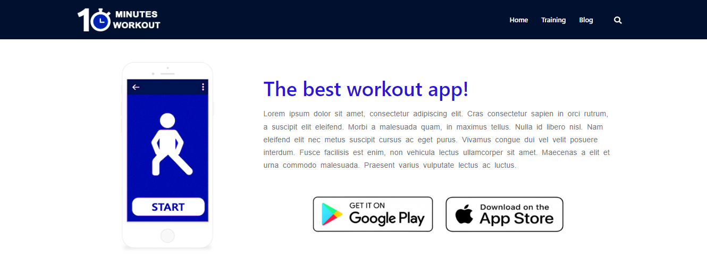
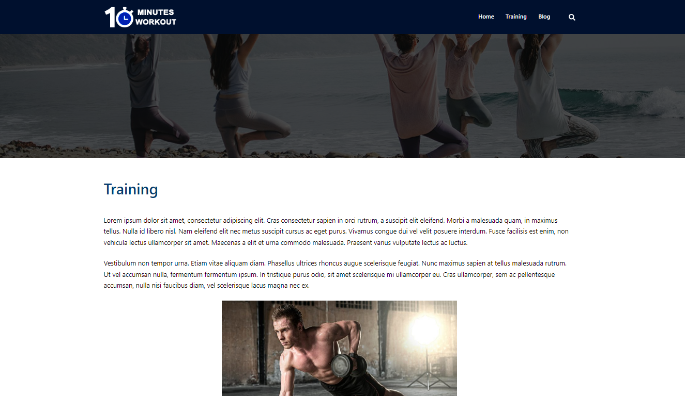
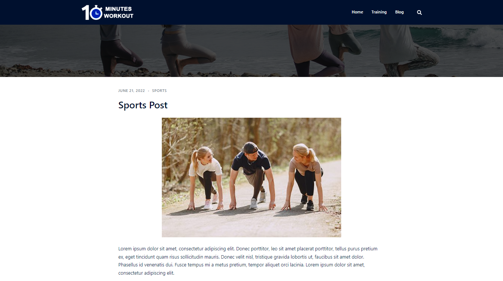

# 10 Minutes Workout: WordPress+Elementor Website

This project is a website built with WordPress and Elementor that promotes a fictional fitness app named 10 Minutes Workout, the map on the home page is illustrative and it shows New York.

## Screenshot 1: Home Page

## Screenshot 2: Home Page 

## Screenshot 3: Home Page

## Screenshot 4: Home Page

## Screenshot 5: Home Page

## Screenshot 6: Training Page

## Screenshot 7: Blog Page

## Technology Stack

+ WordPress
+ Elementor
